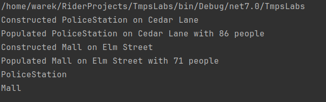

# Topic: *Behavioral Design Patterns*

## Author: 
*Dobrojan Alexandru* FAF-212

------
## Objectives:
&ensp; &ensp; __1. Study and understand the Behavioral Design Patterns.__

&ensp; &ensp; __2. As a continuation of the previous laboratory work, think about what communication between software entities might be involed in your system.__

&ensp; &ensp; __3. Create a new Project or add some additional functionalities using behavioral design patterns.__


## Implementation
My code is related to construction in a city region.

### **Command**
Command is implemented in form of an event object. BuildEvent is the base class with Execute method
```csharp
public abstract class BuildingEvent : IBuildEvent {
  public enum EventType {
    Construct,
    Populate,
    Deconstruct
  }
    
...
    
  public abstract void Execute();
}
```
With subclasses that represent a real event
```csharp
public class ConstructEvent : BuildingEvent {
  public ConstructEvent(CityRegion region, string name) :
      base(region, EventType.Construct, name) { }

  public override void Execute() {
    var building = BuildingFactory.CreateRandomBuilding();
    building.Name = Name;
    Region.AddBuilding(building);
  }
}
public class DeconstructEvent : BuildingEvent {
  public DeconstructEvent(CityRegion region, Building b) : base(region, EventType.Deconstruct, b.Name) { }

  public override void Execute() {
    Region.Destroy(Building);
  }
}
```

### **Observable**
Observable is in form of an interface with exposed Subscribe method
```csharp
public interface IObservable<T, V> {
  public void Subscribe(Action<T, V> callback);
}
```
And in main method of app I subscribe to events on buildings of a particular region. It accepts a callback with 2 parameters, the building which was modified and the type of the event. The event can be of type construction, populate, deconstruction.
```csharp
region1.Subscribe((building, type) => {
  switch (type) {
    case EventType.Construct:
      Console.WriteLine($"Constructed {building.Type} on {building.Name}");
      TownHall.Populate(region1, building, rand.Next(101));
      break;
    case EventType.Deconstruct:
```

### **Iterator**
Regions of the city can be iterated. On iteration, each building is returned from a private list
```csharp
public class CityRegionEnumerator : IEnumerator {
  private          int             _i = -1;
  private readonly IList<Building> _buildings;

  public CityRegionEnumerator(IList<Building> buildings) {
    _buildings = buildings;
  }

  public bool MoveNext() {
    if (_i == _buildings.Count - 1) {
      return false;
    }

    _i++;

    return true;
  }

  public void Reset() {
    _i = -1;
  }

  public object Current => _buildings[_i];
}
```
```csharp
public class CityRegion : IEnumerable
...
  public IEnumerator GetEnumerator() {
    return new CityRegionEnumerator(_buildings);
  }
```

And in program I just iterate over the created buildings
```csharp
foreach (Building b in region1) {
  Console.WriteLine(b.Type);
}
```


# Conclusions / Screenshots / Results
Behavioral design patterns eases the management of behavior (business logic) of the code. Having an application with lots of complex logic and algorithms, defining behavioral patterns would ensure good code principles like open-closed, separation of concerns, DRY etc.


