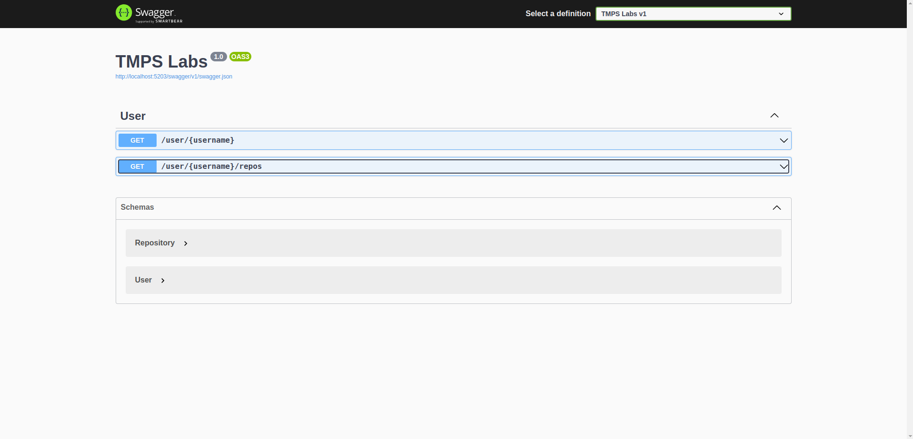
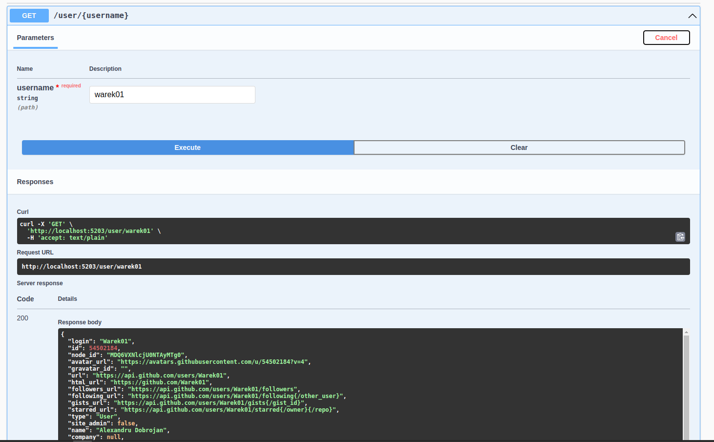
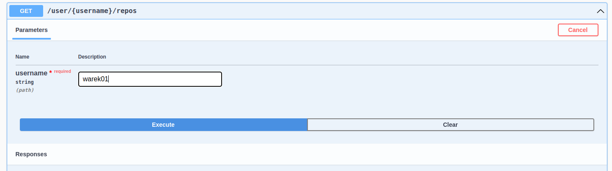

# Topic: *SOLID Principles*

## Author: *Dobrojan Alexandru* FAF-212

------
## Objectives:
&ensp; &ensp; __1. Study and understand the SOLID Principles.__

&ensp; &ensp; __2. Choose a domain, define its main classes/models/entities and choose the appropriate instantiation mechanisms.__

&ensp; &ensp;__3. Create a sample project that respects SOLID Principles.__

## Main tasks:
&ensp; &ensp; __1. Choose an OO programming language and a suitable IDE or Editor (No frameworks/libs/engines allowed).__

&ensp; &ensp; __2. Select a domain area for the sample project.__

&ensp; &ensp; __3. Define the main involved classes and think about what instantiation mechanisms are needed.__

&ensp; &ensp; __4. Respect SOLID Principles in your project.__

## Used principles
**S**ingle responisbility - every data structure or procedure should aim only for a single task. \
**O**pen-closed - classes should be open for extension and closed for modification \
**L**iskov substitution - child classes should be able to interchange parent classes without breaking the functionality \
**I**nterface segregation - only the methods that are used should be present in interfaces \
**D**ependency inversion - dependencies should be realised on interfaces, not classes

## Implementation
Domain that I chose is requesting from an open API (GitHub API in my case) in my own API with caching the results. My app is a small API with swagger UI for representing the endpoints with a fancy GUI, this simulates a part of a real world application, 
however API construction and Swager generation in not a part of the objective, so I will not cover them. The SOLID principles are used in models and services.

First, I have 2 classes in my Models folder representing a user and a repository from the GitHub API, this is needed for runtime serialization. The single responsibility is respected here as only the API properties are being held. Here is a small part of the code
```cs
public class User {
  [JsonPropertyName("login")]            public string   Login           { get; set; }
  [JsonPropertyName("id")]               public int      Id              { get; set; }
  [JsonPropertyName("node_id")]          public string   NodeId          { get; set; }
```
```cs
public class Repository {
  [JsonPropertyName("id")]               public long     Id              { get; set; }
  [JsonPropertyName("name")]             public string   Name            { get; set; }
  [JsonPropertyName("full_name")]        public string   FullName        { get; set; }
```

I have in interface IApiService representing a service class that implements the request of an entity. Liskov substitution is respected because we need and use only this method.
```cs
public interface IApiService<T> where T : class {
  Task<T> Get(string username);
}
```
Next I have a class ApiService that implements that interface. There I respect the single responsibility and open-close principle as it implements GenerateHttpRequest protected method  
```csharp
public abstract class ApiService<T> : IApiService<T> where T : class {
  protected readonly HttpClient Client = new();

  protected HttpRequestMessage GenerateHttpRequest(string url) {
    HttpRequestMessage request = new(HttpMethod.Get, url);
    request.Headers.Accept.Add(new MediaTypeWithQualityHeaderValue("application/json"));
    request.Headers.Add("User-Agent", "Local");

    return request;
  }
  
  public abstract Task<T> Get(string username);
}
```

I have a CacheApiService class that concerns with creating a list of objects that would act as a very simple in memory cache. It extends the ApiService class without
modifying its logic. CacheApiService and ApiService can be interchanged since they implement the same interface, thus respecting the dependency inversion principle. 
```csharp
public abstract class CacheApiService<T> : ApiService<T> where T : class {
  protected List<T> Cache = new();
}
```

The UserService implements CacheApiService for the user, it first searches if the user is already present in the cache, if not - requests it, adds in cache, and returns it.
Later in the program if we would need in some case to always fetch the user data instead of cache, we would create a new class inheriting ApiService and it would be totally compatible with UserService, thus maintaining the dependency inversion.
UserService implements both ApiService and CacheApiService and respects so the Liskov substitution principle.
```csharp
public class UserService : CacheApiService<User> {
  private const string Url = "https://api.github.com/users";

  public override async Task<User> Get(string username) {
    User? user = Cache.Find(u => u.Login.ToLower() == username);

    if (user is not null) {
      return user;
    }

    using HttpRequestMessage request = GenerateHttpRequest($"{Url}/{username}");
    HttpResponseMessage      res     = await Client.SendAsync(request);
    Stream                   stream  = await res.Content.ReadAsStreamAsync();
    user = await JsonSerializer.DeserializeAsync<User>(stream);

    if (user is null) {
      throw new Exception("User is null");
    }

    Cache.Add(user);

    return user;
  }
}
```

The repo service requests repositories of a user, it implements ApiService, thus does not have caching. Not very different from UserService.
```csharp
public class ReposService : ApiService<IEnumerable<Repository>> {
  public override async Task<IEnumerable<Repository>> Get(string username) {
    using HttpRequestMessage request = GenerateHttpRequest($"https://api.github.com/users/{username}/repos");
    HttpResponseMessage      res     = await Client.SendAsync(request);
    Stream                   stream  = await res.Content.ReadAsStreamAsync();
    IEnumerable<Repository>? repos   = await JsonSerializer.DeserializeAsync<IEnumerable<Repository>>(stream);

    if (repos is null) {
      throw new Exception("Repos are null");
    }

    return repos;
  }
}
```

In the controller I realise both dependencies upon IApiService respecting dependency inversion.
Next I use the only exposed method Get to get the entity data and return it for the user. The UserService although implements the same interface as the RepoService,
it realises caching.
```csharp
[ApiController]
public class UserController : Controller {
  private readonly IApiService<User>                    _userService;
  private readonly IApiService<IEnumerable<Repository>> _reposService;

  public UserController(
    IApiService<User>                    userService,
    IApiService<IEnumerable<Repository>> reposService
  ) =>
    (_userService, _reposService) = (userService, reposService);

  [HttpGet, Route("/user/{username}")]
  public Task<User> GetUser(string username) {
    return _userService.Get(username);
  }

  [HttpGet, Route("/user/{username}/repos")]
  public Task<IEnumerable<Repository>> GetRepos(string username) {
    return _reposService.Get(username);
  }
}
```

# Conclusions / Screenshots / Results
Using the SOLID principles not only made the development of the app easier, but also the debug. Also the code became more predictable 
because we know what methods to expect from the dependencies, we do not worry that we accidentally modified some functionality of a clas and we could easily scale up the application by extending the classes with the dependencies remaining the same - on one interface.

Overview:


For my GitHub profile, this is the result. If I make subsequent requests to this profile, the result from the cache will be returned.

Payload:
```json
{
  "login": "Warek01",
  "id": 54502184,
  "node_id": "MDQ6VXNlcjU0NTAyMTg0",
  "avatar_url": "https://avatars.githubusercontent.com/u/54502184?v=4",
  "gravatar_id": "",
  "url": "https://api.github.com/users/Warek01",
  "html_url": "https://github.com/Warek01",
  "followers_url": "https://api.github.com/users/Warek01/followers",
  "following_url": "https://api.github.com/users/Warek01/following{/other_user}",
  "gists_url": "https://api.github.com/users/Warek01/gists{/gist_id}",
  "starred_url": "https://api.github.com/users/Warek01/starred{/owner}{/repo}",
  "type": "User",
  "site_admin": false,
  "name": "Alexandru Dobrojan",
  "company": null,
  "blog": "",
  "location": "Chisinau, Moldova",
  "email": null,
  "hireable": null,
  "bio": "I like coding.",
  "twitter_username": null,
  "public_repos": 18,
  "public_gists": 0,
  "followers": 8,
  "following": 12,
  "created_at": "2019-08-25T13:06:53Z",
  "updated_at": "2023-09-05T08:35:15Z",
  "repos_url": "https://api.github.com/users/Warek01/repos",
  "events_url": "https://api.github.com/users/Warek01/events{/privacy}",
  "subscriptions_url": "https://api.github.com/users/Warek01/subscriptions",
  "organizations_url": "https://api.github.com/users/Warek01/orgs",
  "received_events_url": "https://api.github.com/users/Warek01/received_events"
}
```

And for the repos. It is not cached.

Payload:
```json
[
  {
    "id": 597670657,
    "name": "aa-labs",
    "full_name": "Warek01/aa-labs",
    "description": null,
    "html_url": "https://github.com/Warek01/aa-labs",
    "stargazers_count": 0,
    "watchers_count": 0,
    "language": null,
    "created_at": "2023-02-05T09:16:39Z",
    "updated_at": "2023-02-05T09:16:39Z",
    "owner": {
      "login": "Warek01",
      "id": 54502184,
      "node_id": "MDQ6VXNlcjU0NTAyMTg0",
      "avatar_url": "https://avatars.githubusercontent.com/u/54502184?v=4",
      "gravatar_id": "",
      "url": "https://api.github.com/users/Warek01",
      "html_url": "https://github.com/Warek01",
      "followers_url": "https://api.github.com/users/Warek01/followers",
      "following_url": "https://api.github.com/users/Warek01/following{/other_user}",
      "gists_url": "https://api.github.com/users/Warek01/gists{/gist_id}",
      "starred_url": "https://api.github.com/users/Warek01/starred{/owner}{/repo}",
      "type": "User",
      "site_admin": false,
      "name": null,
```

